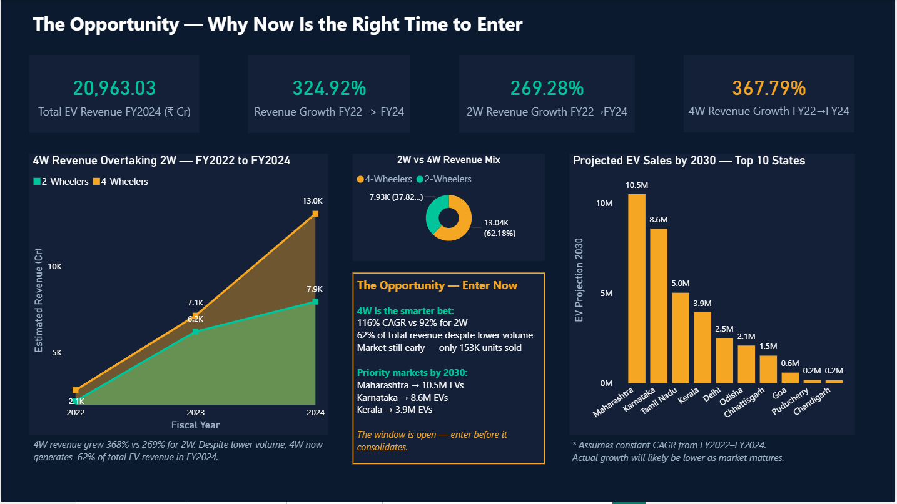

# ⚡ India EV Market Intelligence
### Should an automaker enter India's EV market — and how?

---

**The ask:** A global automaker with <2% share in India needed to know *where, which states, and when* to launch. I analyzed **2M+ vehicle registrations** (FY22–FY24, 30+ states, 20+ makers) from India's official [Vahan Sewa](https://vahan.parivahan.gov.in/) portal to find out.

---

## 3 findings that shaped the strategy

**🎯 Enter 4-wheelers, not 2-wheelers.** 4W drive **62% of EV revenue** from just 7.4% of units, growing at 116% CAGR — with no dominant player yet. The 2W market has already consolidated (OLA grew 23× and locked it up). The 4W window is open; the 2W window has closed.

**📍 Lead with Karnataka, not Delhi.** Karnataka hits **11.6% EV penetration with zero subsidies** vs Delhi's 9.4% *with* ₹30K incentives. Organic, demand-led adoption beats incentive-driven — it's more durable.

**📅 Launch in October, avoid June.** Sales swing from a 291K March peak to a 107K June trough (–63%). Build in monsoon, launch for the festive surge.

---

## Recommendation in one line
> **Enter the 4-wheeler segment, lead with Karnataka, and launch into the October festive peak** — an early market with no incumbent, durable demand, and clear timing.

---

## The full picture

### The market is maturing, not stalling
India sold 2M+ EVs in three years, growing 4× in volume. YoY growth cooled from 186% to 31.5% — a normal maturation curve, not a slowdown. The number that matters: **95 of every 100 vehicles sold is still non-electric.** The headroom is enormous.

### 4-wheelers win the value war
2-wheelers dominate volume (92.6% of units) but 4-wheelers generate **62% of revenue from just 7.4% of sales**. 4W grew at 116% CAGR vs 92% for 2W, and accelerated in FY24 (83% YoY vs 28%). A single 4W EV earns **17.6× the revenue** of a 2W.

### No incumbent owns the 4W segment yet
Tata leads with 48K units in FY24 — strong, but no monopoly. Mahindra, MG, and Hyundai are all climbing fast. BYD grew 566% CAGR off a tiny base — a 3–5 year watch signal, not a today threat. There's still room to enter.

### Karnataka's demand is organic
Karnataka's 11.6% penetration beats Delhi's 9.4% *despite* Delhi's ₹30K purchase subsidies and road-tax waivers. Adoption driven by Bengaluru's tech economy is more durable than incentive-propped demand — and a safer long-term bet.

### Timing follows a clear rhythm
March drives 291K units (fiscal year-end fleet buys, subsidy deadlines); June drops to 107K at monsoon onset. October–December form a festive secondary peak — the ideal launch window.

---

## How I built it

| Stage | Tool | What I did |
|-------|------|------------|
| **Extract & clean** | MySQL | Cleaned and structured 2M+ raw registration records |
| **Analyze** | SQL | 10 analytical queries on segment, state & time trends |
| **Visualize** | Python | 5 charts (Matplotlib/Seaborn) matching dashboard theme |
| **Dashboard** | Power BI + DAX | 4-page interactive dashboard with custom measures |
| **Communicate** | PowerPoint | 11-slide executive deck with the strategic recommendation |

---

## What's inside

| File | Description |
|------|-------------|
| `EV_Market_Dashboard.pbix` | Power BI dashboard — 4 pages |
| `ev_market_queries.sql` | 10 analytical SQL queries |
| `EV_charts.py` | 5 Python charts |
| `India_EV_market_Report.pptx` | 11-slide executive deck |

---

---
*Revenue estimated using assumed unit prices (2W ₹85K · 4W ₹15L). Projections are directional, not forecasts.*
